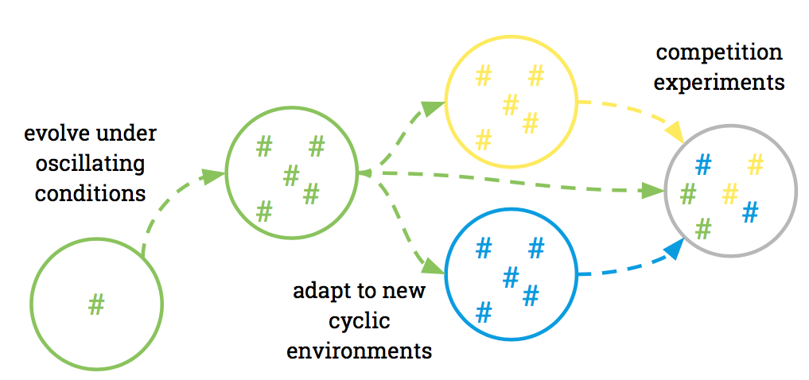

## Experimental Design

### Research Questions

- What are strategies to cope with two alternating, oscillating resources?
- How does the genome reshape under these oscillating conditions?
- __What are the boundary conditions that allow for the evolution of circadian clocks? Mutation rate, oscillation (length compared to organisms live cycle, length differences between phases, 12h/12h vs. 16h/8h etc.), reward differences, resources limitation...__
- What, if any, is the fitness advantage in competition to no-clock organisms?
- What, if any, is the fitness advantage in competition to different cycling organisms?
- Can the evolved clock adapt to new cyclic environments? No mutations allowed, put clock organisms into new phase world.

## Roadmap
### Goals

1. Replicate [Beckmann et al., 2007](http://www.ofria.com/pubs/2007bBeckmannEtAl.pdf) and add second alternating resource cycle.
2. Create a pool of organisms with circadian clocks.
3. __Find boundary conditions that allow for the evolution of circadian clocks, i.e. mutation rate, different reward for resources, "day lenght".__
4. Adapt clock organism pool to different cyclic environments.
5. Examine fitness in competition experiments with no-clock organisms and other clock organisms.

### Timeline
#### September

- [x] Create Repo, Readme, Code of Conduct, License, Contribution Guidelines and Roadmap
- [x] Create Wiki and add information about the project
- [x] Attend Kick-Off meeting in Berlin [9-11.September]

#### October

- [x] Get Avida running and get familiar with all options and settings
- [x] Start replicating [Beckmann et al., 2007](http://www.ofria.com/pubs/2007bBeckmannEtAl.pdf)
- [x] Book flights to Chicago and find place to stay at MSU

#### November

- [ ] Write midway report
- [ ] Finish replicating [Beckmann et al., 2007](http://www.ofria.com/pubs/2007bBeckmannEtAl.pdf)
- [ ] ---

#### December

- [ ] Add circadian conditions to the existing scripts
- [ ] ---
- [ ] ---

#### January

- [ ] ---
- [ ] ---
- [ ] ---

#### February

- [ ] ---
- [ ] ---
- [ ] ---

#### March

- [ ] Attent final meeting in Berlin
- [ ] Write final report
